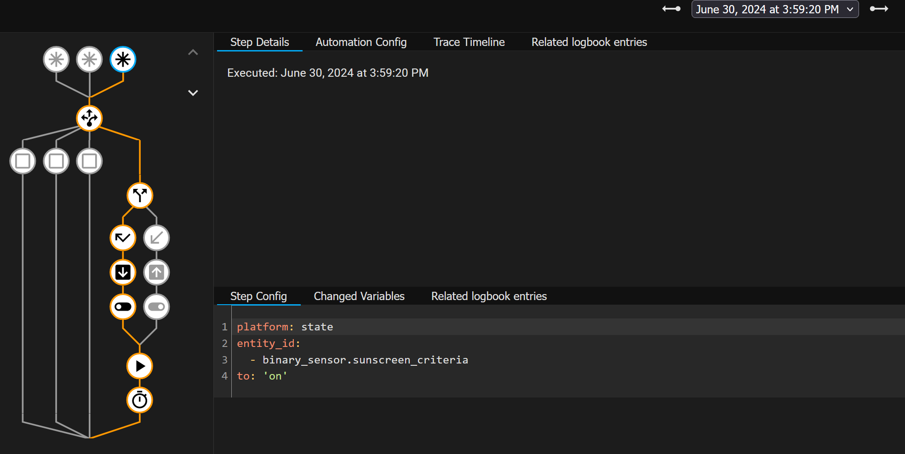
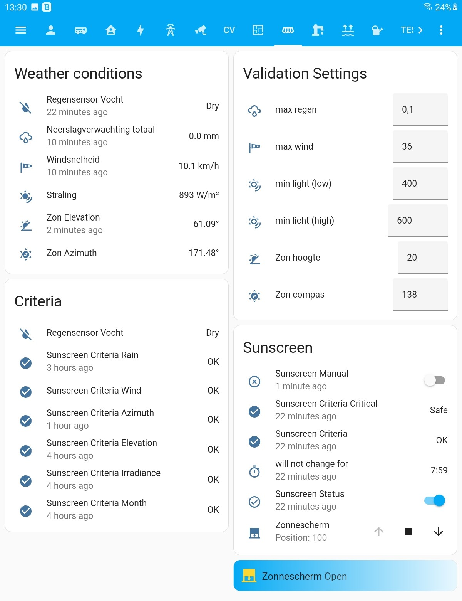

# Sunscreen
Sunscreen Automation in Home Assistant (YAW2A)

### New Version
! A year later it was time for an update; with the introduction of two group binary sensors the automation is much simpler. 
You only need to put ALL criteria in binary_sensor.sunscreen_criteria.
And those criteria who need instant action in binary_sensor.sunscreen_criteria_critical.
The automation YAML will not require additional changes and is pretty straightforward.
More to read, like which simple problems I had to taccle see also 

I als introduced a (local) rain sensor, there are topics inside the HA-forum but also this post looks very much like mine:
https://en.number13.de/homeassistant-zha-zigbee-rain-sensor-hack-build-yourself/
I have good experience with the used sensor; in another project were I replaced the "vlotter" of a pump they are still on 100% despite +100k activity.

### Starting
There are many type of sunscreen / blinds and perhaps after lights your next thing to automate.
With fresh or read zero experience in Home Assistant and YAML's, I tried to RTFM and find proper examples.
The start example suitable for my sunscreen I found in this topic published by Remco:

see: https://community.home-assistant.io/t/how-to-automate-my-awning-sunscreen/40813/91

stubborn as i am changed things, (likely to understand better the proces), hence the reason I did not fork his repository.

see: https://github.com/remb0/Sunscreen

So this automation is suitable for a (outside the house) sunscreen with only two options:
- CLOSED (for me inside container)
- OPEN (for me sunscreen fully opened)

It is possible you would like to see it working differently, this only requires perhaps small changes in the automation.

### Weather Conditions

This is done based on the following weather conditions:
For this process the folowing sensors are used:
- rainsensor (own sensor)
- rain (using Buienrader.nl but feel free to change)
- wind (using Buienrader.nl but feel free to change)
- irradiance (using Buienrader.nl but feel free to change)
- Azimuth (from sun.sun)
- Elavation (from sun.sun)
- in which months to operate
- anything else what better suits your needs like time, temperature, lumination, solar values, etc

The tricky part remains the amount of sun; presently this is done based upon sensor.buienradar_irradiance but I am thinking to change this part in a more local option with a lux sensor. I already have the weather station installed,

To avoid frequent roll-in and roll-out's of the sunscreeen based upon this condition a bandwith is used, it is also possible your sensor can provide an acverage or combine both.

### Input Number Helpers
These weather conditions are compared against their valid values (just create them manual in helpers):
- input_number.sunscreen_valid_rain
- input_number.sunscreen_valid_wind
- input_number.sunscreen_valid_irradiance a _low and a _high value 
- input_number.sunscreen_valid_azimuth
- input_number.sunscreen_valid_elevation

In principle you do not need these, you can also hardcode in the template file (like done with months) or use directly the sensor (like done with the own rainsensor).

### Template File
It is advised not to use the tamplate file for these binary sensors but add each sensor in "create sensors" because refressing "template entities" will make manual sensors temporarily unavailable which can result in a unwanted swich of the group binary sensor from UNSAFE to SAFE and activate the automation.

A template file needs to be created in your template folder with following binary sensors (see )
- binary_sensor.sunscreen_criteria_rain
- binary_sensor.sunscreen_criteria_wind
- binary_sensor.sunscreen_criteria_irradiance
- binary_sensor.sunscreen_criteria_azimuth
- binary_sensor.sunscreen_criteria_elevation

TIP: After update your template yaml you only need to refresh "template entities" (please check configuration first, no need for a reload or restart of HA itself))

BETTER TIP Nowadays you can also create in "settings - create helpers" a template sensor. With this method you have easier access to the sensor (and avoid tools like VSC). However still using a textual file because it is easier to share.

### Helper sensors
These binary sensors are grouped together in the group binay sensors:
- binary_sensor.sunscreen_criteria          # your collection of ALL binary sensors which are criteria for open/close sunscreen
- binary_sensor.sunscreen_criteria_critical # your collection of CRITICAL binary sensors which are criteria for open/close sunscreen
Besides the two sensor the next three sensors are used in the dashboard and automation: 
- timer.sunscreen_delay                     # the time next sunscreen action will be dome if delayed
- input_boolean.sunscreen_manual            # manual overide, however critical criteria will close the sunscreen
- input_boolean.sunscreen_status            # present status of the sunscreen (

### Automation
Steps in the automation are (see: (see )

- Triggers: timer not idle or sunscreen criteria sensor changed
- Conditions: only continue when there is a change in status and not in manual or not-idle modus (unless it is critical)
- Perform sunscreen actions and (re)set timer

Inside the UI you can create a new automation, go into YAML view and copy this file

### Dashboard
The endresult in the dashboard looks like:

BTW = By The Way YAW2A = Yet Another Way to Automate.
TECP = Trial & Error, Cut & Paste
